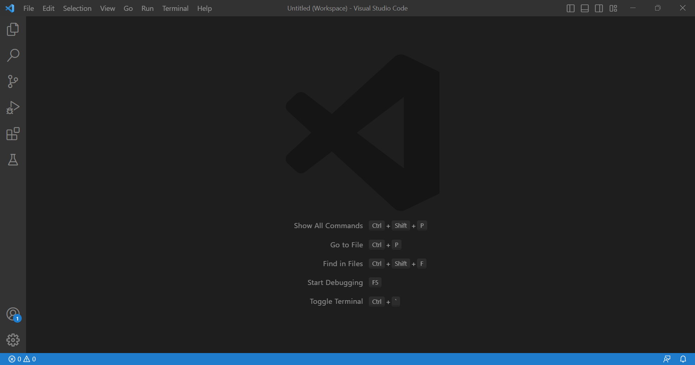
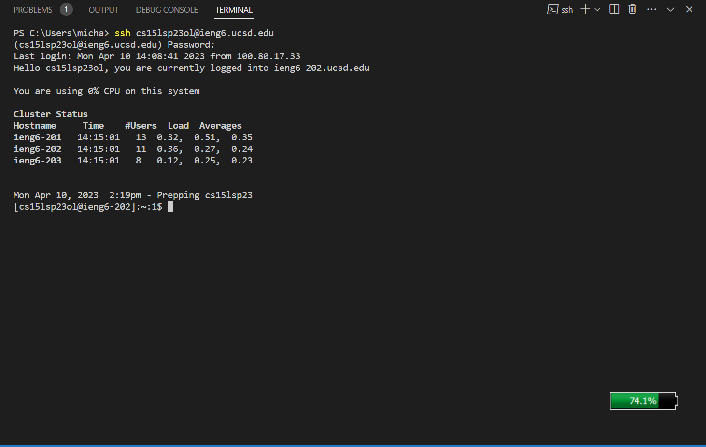
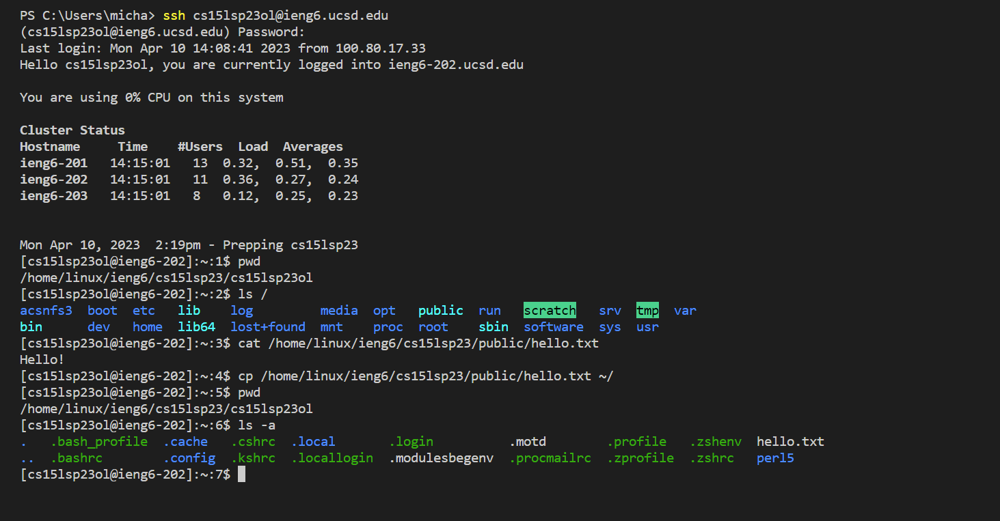

# Lab Report 1
## Step 1: Installing VSCode
Install VSCode going to this [link](https://code.visualstudio.com/) and downloading it for your software.
After downloading, run the exe file and follow the steps. 

Upon opening you'll see something like this on VSCode

After opening up VSCode, create a new Terminal by going to "Terminal" on top, selecting it, and clicking New Terminal. Using " Ctrl+Shift+\` " will work too.
## Step 2: Remotely Connecting
Once at the terminal, we remotely connect using the `ssh` command to log into a course account under an `ieng6.ucsd.edu` email. To find your course account username, you go on this link and put in your username and student id:

[https://sdacs.ucsd.edu/~icc/index.php](https://sdacs.ucsd.edu/~icc/index.php)

Your username will be the account that starts with `cs15lsp23` such as such as `cs15lsp23ko`, the email to use to log in terminal will have `@ieng6.ucsd.edu` at the end of it. If a password has not been set up for the account yet, open and view this [pdf](https://drive.google.com/file/d/17IDZn8Qq7Q0RkYMxdiIR0o6HJ3B5YqSW/view?usp=share_link) to see how to set a password.

After finding your account, log in using your cs15l email and newly set up password if it wasn't already set.

This image shows how logging in is done and what the result should be.

Some issue can arise from logging on here. One issue is if your account password was recently set, it may not register on the terminal and not allow you to login with your cs15l account. If this happens, waiting until the password is registered will solve the issue. If there are still issues, check if your username and password are put in correctly. Also don't copy and paste the password in as the terminal may not register the password if it's pasted in instead of being typed.

An alternative account can be used to log in with `ssh` if there are still issues even trying those solutions. This can be done using your UCSD account and password instead. When using your UCSD account, use `@ieng6.ucsd.edu` instead of `@ucsd.edu`. 
## Step 3: Trying Some Commands
Here we can try commands on the terminal. The main commands are listed here:
`pwd` which shows the current directory. `cd <path>` which changes the directory to the desired path, `ls <path>` which shows all the files in the specified directory, and `cat <path1> <path2>` which prints the files specified in `<path1>` and/or `<path2>`.
Some commands that can be tried out are listed here:

`cd ~` -changes the directory from the current directory to the home directory.

`ls -lat` - shows main files and hidden files in directory with details such as information on size, ownership, and modification time.

`ls -a` - shows files in directory including hidden files not usually seen when executing only ls/.

`cp /home/linux/ieng6/cs15lsp23/public/hello.txt ~/` - copies the hello.txt file into the home directory.

`cat /home/linux/ieng6/cs15lsp23/public/hello.txt` - prints the contents of hello.txt.

Example of some commands run:

The following commands in that screenshot are ran:

`pwd` - shows current directory

`ls /` - reveals files in / directory

`cat /home/linux/ieng6/cs15lsp23/public/hello.txt` - prints what's in hello.txt file

`cp /home/linux/ieng6/cs15lsp23/public/hello.txt ~/` - copies hello.txt file to home directory

`ls -a` shows all files including hidden ones in directory

To log out, use Ctrl + D hotkey or run `exit` in the terminal.

