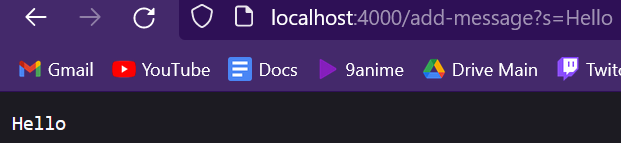
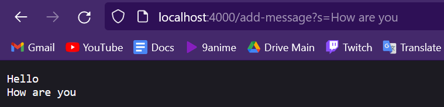

# CSE 15L Lab Report 2

## Part 1

`StringServer` code:
```
import java.io.IOException;
import java.net.URI;
class Handler implements URLHandler {    
    int num = 0;    
    String str = "";    
    public String handleRequest(URI url) {    
        if (url.getPath().equals("/")) {       
            return String.format(str);           
        } else {       
            System.out.println("Path: " + url.getPath());            
            if (url.getPath().contains("/add-message")) {           
                String[] parameters = url.getQuery().split("=");               
                if (parameters[0].equals("s")) {                
                    str += parameters[1] + "\n";                    
                    return String.format(str);                    
                }                
            }
            return "404 Not Found!";            
        }        
    }    
}

public class StringServer {
    public static void main(String[] args) throws IOException {
        if(args.length == 0){
            System.out.println("Missing port number! Try any number between 1024 to 49151");
            return;
        }
        int port = Integer.parseInt(args[0]);
        Server.start(port, new Handler());
    }
}
```
Screenshots of using `/add-message`:



The methods called in the screenshot above are `parseInt(args[0])` for `int port`, which parses what is inputted into `args[0]` when the command `java StringServer 4000` is ran on the terminal. 4000 will be the port `StringServer` runs on. Then `Server.start(port, new Handler());` method is ran which starts a webserver with the port and a new `Handler` class. The `Handler` class then runs the method `handleRequest`, which takes in the parameter `URI url`. When `handleRequest` is called it is called with the argument `http://localhost:4000/add-message?s=Hello` in the parameter. The values of the field change because the url adds the string "Hello" to the web server.



The methods called in the second screenshot are `handleRequest` in the `Handler` class. This is the only method called as the web server is already running and so it only needs to run a new addition to `StringServer`, mainly the line `How are you` using `/add-message?s=How are you`. The value of the field changes here with the parameter of `handleRequest` being `http://localhost:4000/add-message?s=How are you`.

## Part 2

The failure inducing input:

```  
  @Test
  public void testReversed2() {
    int[] input1 = {1,2,3};
    assertArrayEquals(new int[]{3,2,1}, ArrayExamples.reversed(input1));
  } 
  ```
Input that doesn't induce failure:

```
  @Test
  public void testReversed() {
    int[] input1 = { };
    assertArrayEquals(new int[]{ }, ArrayExamples.reversed(input1));
  }
```

The symptom:


Code for method before fix:
```
  static int[] reversed(int[] arr) {
    int[] newArray = new int[arr.length];
    for(int i = 0; i < arr.length; i += 1) {
      arr[i] = newArray[arr.length - i - 1];
    }
    return arr;
  }
```
Code for method fixed:
```
  static int[] reversed(int[] arr) {
    int[] newArray = new int[arr.length];
    for(int i = 0; i < arr.length; i += 1) {
      newArray[i] = arr[arr.length - i - 1];
    }
    return newArray;
  }
```

Explanation:
The fix addresses the issue by having the `reversed` method update the values of `newArray` with values of the current array `arr`, the bug was that the code was changing the values of `arr` with `newArray` changing every value of `arr` to be 0 since `newArray` was just created and doesn't have any values besides 0 assigned to it. With the change, it fixes this having `NewArray` being assigned the values of `arr` in reverse leading to a reversed array.
