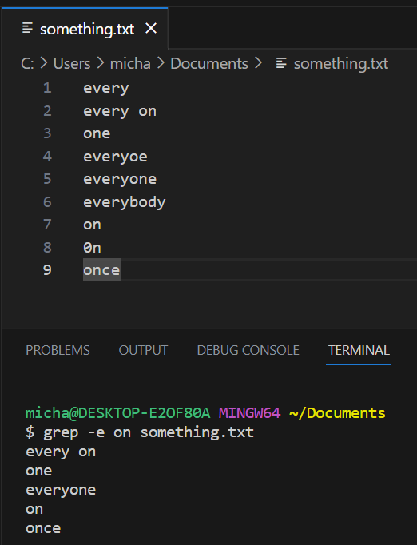

# CSE 15L Lab Report 3

## Researching Commands
The command `grep` searches for a line in a file based on the input given. There are many other command-line options for `grep`. 

One option for `grep` is `-e`, which allows `grep` to look for lines based on a pattern given by the input. Two examples of this is shown here where `grep -e` is being used to look up words in a file text.

Here the commands `grep -e on something.txt` and `grep -e o something.txt` are being executed.

Another option for `grep` is `-v`, it prompts `grep` to look for lines that don't have the specified input. For example in several lines of words, if `grep -v on something.txt` was called, it would look for every line that doesn't contain "on" including words that have "on" in it like "everyone". Two examples of `grep -v` being used are shown here:

In this picture, the commands `grep -v every something.txt` and `grep -v on something.txt` are called. The first command looks for every line that doesn't contain "every" in. The second command looks for every line that doesn't contain "on" in it. This is useful to look for lines in a file that don't contain a specific character or word.

A third command option for `grep` is `-n` which looks for a line based on given input and indicates the line number for each line that fits the input. Two examples of `grep -n` are seen here.

The first command, `grep -n e something.txt`, shows the line number of each line that has the character "e" in it. The second command, `grep -n o something.txt`, also outputs each line's line number. This is especially useful when looking for lines that have a specific character or word in a long text file or code file.

A fourth command-line option that can be used with `grep` is `-c`. It doesn't output the lines that fit the given input, but instead outputs the total amount of lines that fit the given input. An example of `grep -c` in use for the following text file is:

This example, `grep -c e something.txt`, gives the total amount of lines that have the character "e" in it, being 7.

A second example of `grep -c` is seen here.

This second example, `grep -c h something.txt`, outputs the amount of lines with the character "h", being 2.

This command is useful for times when someone wants to only look for the total amount of lines with a specific character, word, or words instead of every line containing that.

