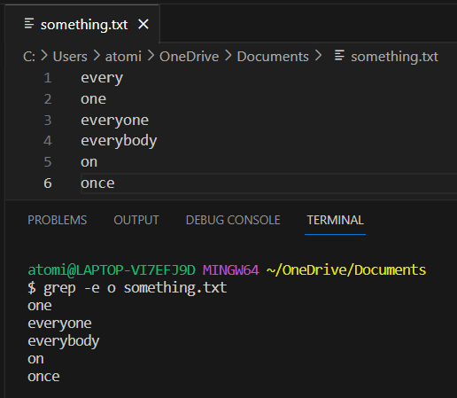

# CSE 15L Lab Report 3

## Researching Commands
The command `grep` searches for a line in a file based on the input given. There are many other command-line options for `grep`. 

One option for `grep` is `-e`, which allows `grep` to look for lines based on a pattern given by the input. Two examples of this is shown here where `grep -e` is being used to look up words in a file text.

Here the commands `grep -e on something.txt` and `grep -e o something.txt` are being executed.

Another option for `grep` is `-v`, it prompts `grep` to look for lines that don't have the specified input. For example in several lines of words, if `grep -v on something.txt` was called, it would look for every line that doesn't contain "on" including words that have "on" in it like "everyone". Two examples of `grep -v` being used are shown here:

![Image]

