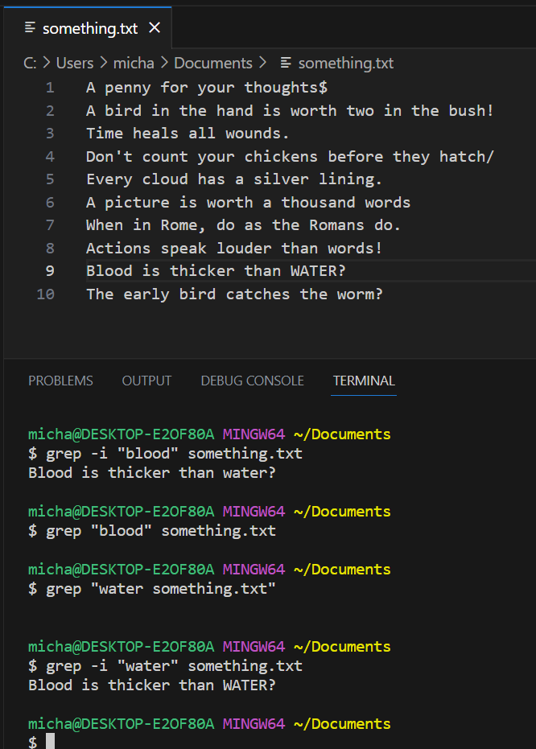

# CSE 15L Lab Report 3

## Researching Commands
The command `grep` searches for a line in a file based on the input given. There are many other command-line options for `grep`. 

One option for `grep` is `-i` which prompts the command to look for lines containing the given input ignoring whether they're upper case or not. Two examples of `grep -i` in action are seen here.



Here the commands `grep -i "blood" something.txt` and `grep -i "water" something.txt` are being executed. `grep -i "blood" something.txt` looks for lines with the word "blood" in it and outputs the line "Blood is thicker than WATER?" even though blood is capitalized on that line. In `grep -i "water" something.txt`, the command looks for lines with the word water, and outputs the line "Blood is thicker than WATER?" even though water is in all caps on that line. This option is useful to look for every instance of a word in a file whether it is capitalized or not.

Another option for `grep` is `-v`, it prompts `grep` to look for lines that don't have the specified input. For example in several lines of words, if `grep -v on something.txt` was called, it would look for every line that doesn't contain "on" including words that have "on" in it like "everyone". Two examples of `grep -v` being used are shown here:


In this picture, the commands `grep -v every something.txt` and `grep -v on something.txt` are called. The first command looks for every line that doesn't contain "every" in. The second command looks for every line that doesn't contain "on" in it. This is useful to look for lines in a file that don't contain a specific character or word.

A third command option for `grep` is `-n` which looks for a line based on given input and indicates the line number for each line that fits the input. Two examples of `grep -n` are seen here.


The first command, `grep -n e something.txt`, shows the line number of each line that has the character "e" in it. The second command, `grep -n o something.txt`, also outputs each line's line number. This is especially useful when looking for lines that have a specific character or word in a long text file or code file and need to find what line number it is.

A fourth command-line option that can be used with `grep` is `-c`. It doesn't output the lines that fit the given input, but instead outputs the total amount of lines that fit the given input. An example of `grep -c` in use for the following text file is:


This example, `grep -c e something.txt`, gives the total amount of lines that have the character "e" in it, being 7.

A second example of `grep -c` is seen here.


This second example, `grep -c h something.txt`, outputs the amount of lines with the character "h", being 2.

This command is useful for times when someone wants to only look for the total amount of lines with a specific character, word, or words instead of every line containing that.

I found these command line options from the site Wikibooks. I also found them using the command `grep --help` in terminal and it outputted the following.

Wikibooks link: [https://en.wikibooks.org/wiki/Grep](https://en.wikibooks.org/wiki/Grep)

`grep --help` output:

```
$ grep --help
Usage: grep [OPTION]... PATTERN [FILE]...
Search for PATTERN in each FILE or standard input.
PATTERN is, by default, a basic regular expression (BRE).
Example: grep -i 'hello world' menu.h main.c

Regexp selection and interpretation:
  -E, --extended-regexp     PATTERN is an extended regular expression (ERE)
  -F, --fixed-strings       PATTERN is a set of newline-separated strings
  -G, --basic-regexp        PATTERN is a basic regular expression (BRE)
  -P, --perl-regexp         PATTERN is a Perl regular expression
  -e, --regexp=PATTERN      use PATTERN for matching
  -f, --file=FILE           obtain PATTERN from FILE
  -i, --ignore-case         ignore case distinctions
  -w, --word-regexp         force PATTERN to match only whole words
  -x, --line-regexp         force PATTERN to match only whole lines
  -z, --null-data           a data line ends in 0 byte, not newline

Miscellaneous:
  -s, --no-messages         suppress error messages
  -v, --invert-match        select non-matching lines
  -V, --version             display version information and exit
      --help                display this help text and exit

Output control:
  -m, --max-count=NUM       stop after NUM matches
  -b, --byte-offset         print the byte offset with output lines
  -n, --line-number         print line number with output lines
      --line-buffered       flush output on every line
  -H, --with-filename       print the file name for each match
  -h, --no-filename         suppress the file name prefix on output
      --label=LABEL         use LABEL as the standard input file name prefix
  -o, --only-matching       show only the part of a line matching PATTERN
  -q, --quiet, --silent     suppress all normal output
      --binary-files=TYPE   assume that binary files are TYPE;
                            TYPE is 'binary', 'text', or 'without-match'
  -a, --text                equivalent to --binary-files=text
  -I                        equivalent to --binary-files=without-match
  -d, --directories=ACTION  how to handle directories;
                            ACTION is 'read', 'recurse', or 'skip'
  -D, --devices=ACTION      how to handle devices, FIFOs and sockets;
                            ACTION is 'read' or 'skip'
  -r, --recursive           like --directories=recurse
  -R, --dereference-recursive  likewise, but follow all symlinks
      --include=FILE_PATTERN  search only files that match FILE_PATTERN
      --exclude=FILE_PATTERN  skip files and directories matching FILE_PATTERN
      --exclude-from=FILE   skip files matching any file pattern from FILE
      --exclude-dir=PATTERN  directories that match PATTERN will be skipped.
  -L, --files-without-match  print only names of FILEs containing no match
  -l, --files-with-matches  print only names of FILEs containing matches
  -c, --count               print only a count of matching lines per FILE
  -T, --initial-tab         make tabs line up (if needed)
  -Z, --null                print 0 byte after FILE name

Context control:
  -B, --before-context=NUM  print NUM lines of leading context
  -A, --after-context=NUM   print NUM lines of trailing context
  -C, --context=NUM         print NUM lines of output context
  -NUM                      same as --context=NUM
      --color[=WHEN],
      --colour[=WHEN]       use markers to highlight the matching strings;
                            WHEN is 'always', 'never', or 'auto'
  -U, --binary              do not strip CR characters at EOL (MSDOS/Windows)
  -u, --unix-byte-offsets   report offsets as if CRs were not there
                            (MSDOS/Windows)

'egrep' means 'grep -E'.  'fgrep' means 'grep -F'.
Direct invocation as either 'egrep' or 'fgrep' is deprecated.
When FILE is -, read standard input.  With no FILE, read . if a command-line
-r is given, - otherwise.  If fewer than two FILEs are given, assume -h.
Exit status is 0 if any line is selected, 1 otherwise;
if any error occurs and -q is not given, the exit status is 2.

Report bugs to: bug-grep@gnu.org
GNU grep home page: <https://www.gnu.org/software/grep/>
General help using GNU software: <http://www.gnu.org/gethelp/>
```


