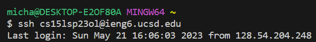
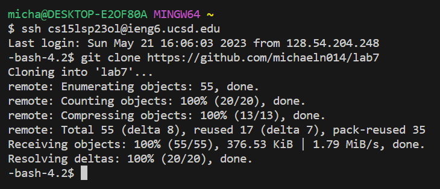
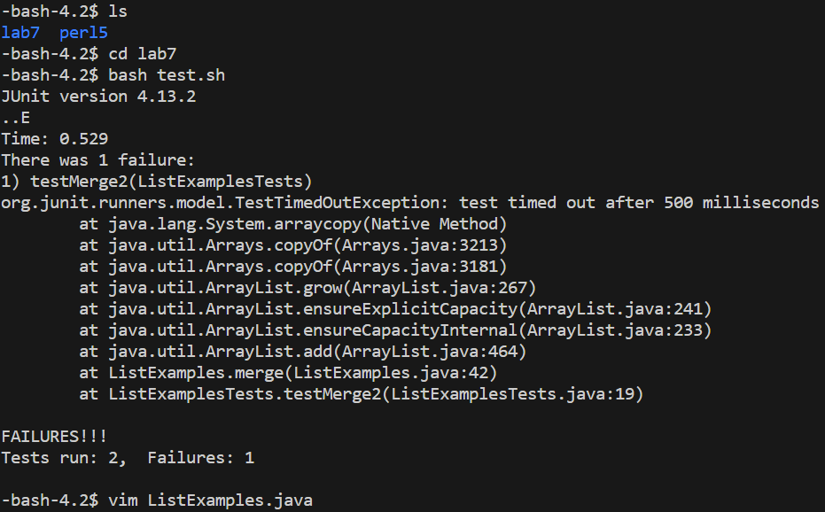
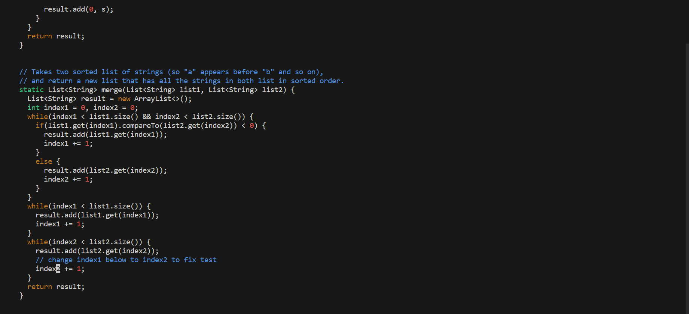
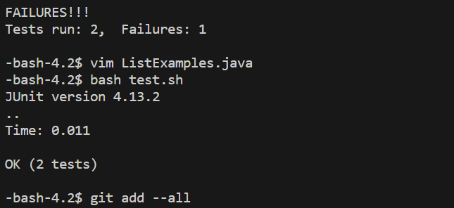
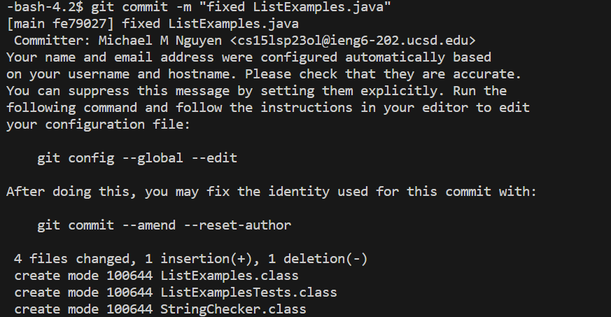
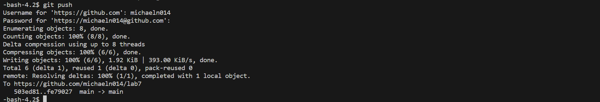

# Lab Report 4

## Step 4

This step took the following keys pressed to complete:

`<up>,<up>,<enter>`

This step took only two `<up>` keys to log into ssh because the command had been previously used two commands ago so I only needed to press it twice to reach the command `ssh cs15lsp23ol@ieng6.ucsd.edu`. After that it only took the key `<enter>` to log in my ssh account. 

## Step 5

The fifth step took the following keys pressed: `<ctrl+r><enter>git<down><up><enter>`. This step took that amount keys pressed to execute to find the command `git clone https://github.com/michaeln014/lab7` through command history in terminal since I had used it before so when `<ctrl>+r` is pressed I could just search for that command, I had used other commands afterwards it was faster to do so than press the `<up>` key several times.

## Step 6

It took the following keys pressed to get this step done:
`cd lab7<enter>`,`<ctrl>r<enter>bash <down><up><enter>`.

It took the amount of keys pressed to get the command `cd lab7` executed to change the directory in terminal to the `lab7` repository. Aferwards to run the files to show the test fails, I used `<ctrl>r` to find the command `bash test.sh` which had been executed before, when finding the command I press `<down><up>` to get the `bash test.sh` command and `<enter>` to run the command.

## Step 7

The command to go into vim is executed pressing the amount of keys to get:

`vim ListExamples.java<enter>`

This is the case because I hadn't executed this command before so the fastest way to run it was to type it down. After that it took one mouse click to get to the line to change and after that took the following keys pressed: 

`llllllxi2<esc>:wq<enter>`

It took 6 presses of the key `l` to get to the character to replace and to delete the key I pressed `x` and then `i` to go into insert mode where I pressed the key `2` to make `key1` be `key2` in order to make the code function properly. After that I pressed `<esc>` to go into normal mode and then typed in `:wq` and `<enter>` to save the file and the changes and exit vim.

## Step 8-9

Step 8 Keys: `<up><up><enter>`

It took only two presses of the `<up>` key to reach `bash test.sh` and the `<enter>` key to run the command again since it had been run previously in step 6.

Step 9 Keys: 
`<ctrl>r<enter>gita<right><enter>`,
`git commit -m "fixed ListExamples.java"<enter>`,
`git push<enter>`

For this step, I was able to use <ctrl> + r to find the command `git add --all. But for `git commit -m "fixed ListExamples.java` and `git push` I hadn't used those commands before so I typed them manually and only used the special key `<enter>` to run the command.
