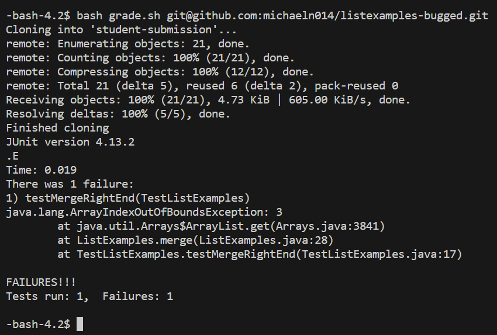
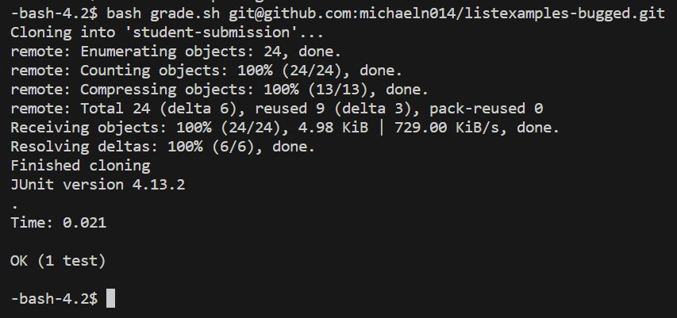

# Lab Report 5

## Debugging Scenario

Student Post:

Their initial test and output:

TA Response:

Are you sure your merge condition is working properly? What have you tried to debug your issue so far? It seems your method is causing the exception because of an incorrect loop condition. The while loops' conditions in your merge method should be less than the size of the ArrayList, you may have your loop contidion set to be less than or equal to the ArrayList size instead of less than. Try the suggested change and see if it fixes the bug.

Student Response to Changes:

The student's implementation of the merge method in ListExamples was incorrectly done. In their implementation of `ListExamples.java`. They had the following condition on the first while loop in the method on line 27:

`while(index1 <= list1.size() && index2 <= list2.size()) {`

The student saw the suggested change by the TA and changed the line removing the `=` sign so the while loop runs as `index1 < list1.size()` and `index2 < list2.size()`. The changed line 27 appears as this:

`while(index1 < list1.size() && index2 < list2.size()) {`

After the change, the ListExamples test passes appearing as this now:

The files consisted of folders `list-examples-grader` and `listexamples-bugged`. `list-examples-grader` mainly has the folder `lib` that has the files needed to run JUnit tests on VSCode, bash file `grade.sh`, `GradeServer.java`, `Server.java`, `TestListExamples.java`. The folder `listexamples-bugged` has the file `ListExamples.java`. In this bug and fix only the file `ListExamples.java` needed to be fixed. Before fixing the file, `ListExamples.java` consisted of this:

`import java.util.ArrayList;
import java.util.List;

interface StringChecker { boolean checkString(String s); }

class ListExamples {

  // Returns a new list that has all the elements of the input list for which
  // the StringChecker returns true, and not the elements that return false, in
  // the same order they appeared in the input list;
  static List<String> filter(List<String> list, StringChecker sc) {
    List<String> result = new ArrayList<>();
    for (String s : list) {
      if (sc.checkString(s)) {
        result.add(s);
      }
    }
    return result;
  }

  
  // Takes two sorted list of strings (so "a" appears before "b" and so on),
  // and return a new list that has all the strings in both list in sorted order.
  static List<String> merge(List<String> list1, List<String> list2) {
    List<String> result = new ArrayList<>();
    int index1 = 0, index2 = 0;
    while(index1 < list1.size() && index2 < list2.size()) {
      if(list1.get(index1).compareTo(list2.get(index2)) < 0) {
        result.add(list1.get(index1));
        index1 += 1;
      }
      else {
        result.add(list2.get(index2));
        index2 += 1;
      }
    }
    while(index1 < list1.size()) {
      result.add(list1.get(index1));
      index1 += 1;
    }
    while(index2 < list2.size()) {
      result.add(list2.get(index2));
      index2 += 1;
    }
    return result;
  }
  
}`

The command that triggered the bug was `bash grade.sh git@github.com:michaeln014/listexamples-bugged.git`.

The bug was that the while loop in merge() in `ListExamples.java` was incorrectly implemented. The condition makes the loop call for an index that does not exist in list1 and list2 causing the `ArrayIndexOutOfBoundException`.

## Reflection

Something I learned in the second half of the quarter I hadn't learned before was how an autograder for a coding file worked and using vim to edit code. I found it interesting how it tests code and I hadn't known how code was automatically graded before. I also found interesting how vim worked in terminal, though using it is a challenge, I still found vim convenient and not too hard to use and I see the conveniences of editing code on terminal with vim instead of an IDE.
