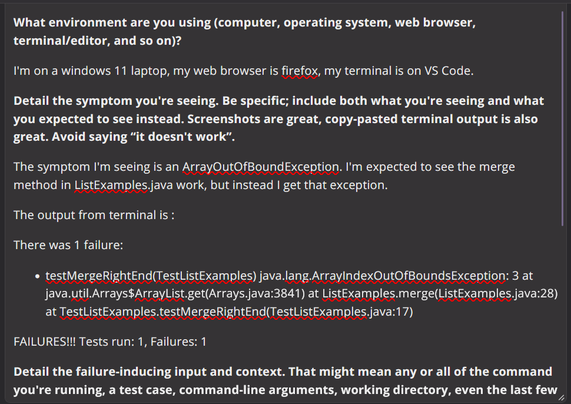
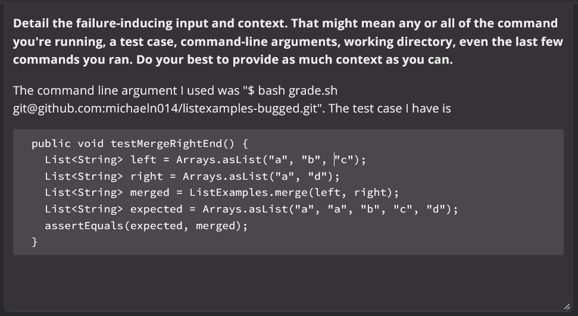

# Lab Report 5

## Debugging Scenario

Student Post:

TA Response:

Are you sure your merge condition is working properly? What have you tried to debug your issue so far? It seems your method is causing the exception because of an incorrect loop condition. The while loops' conditions in your merge method should be less than the size of the ArrayList, you may have your loop contidion set to be less than or equal to the ArrayList size instead of less than. Try the suggested change and see if it fixes the bug.

Student Response to Changes:

